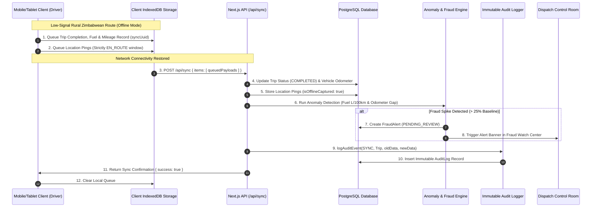

# MotaLink - System Data Flow Architecture & Interactions

This document describes the architectural interaction between client devices, offline synchronization queues, backend micro-services, the fraud detection engine, compliance alerts, and the immutable audit log.

---

## Key Data Flow Interactions

### 1. Offline-First Mobile Synchronization (Module 3 & 7)
- **Local Queuing**: When a driver operates in remote or low-signal Zimbabwean routes (e.g. Forbes Border, Chiredzi, Nyamapanda), trip updates, fuel fills, and telemetry pings are written to IndexedDB with a unique `syncUuid`.
- **Sync Processor**: Upon network restoration, the client issues a single atomic batch payload to `/api/sync`.
- **Anomaly Detection Integration**: As part of the sync pipeline, `/api/sync` invokes `runAnomalyDetection()`. If logged fuel consumption exceeds the category baseline by > 25% (e.g., DAF Haulage truck logging 54.2 L/100km vs 36.0 L/100km baseline), a `FraudAlert` record is automatically generated for auditor review.

### 2. Decommissioning & Resale Archival Flow (Module 1 & 8)
- **State Transition**: When a vehicle leaves the fleet (due to high maintenance costs or resale), its status is updated to `DECOMMISSIONED` or `RESOLD`.
- **Data Integrity**: Historical trips, service records, parts costs, and compliance records remain fully linked and intact for future auditing.
- **Audit Logging**: A `DECOMMISSION` or `RESALE` audit event is written to `AuditLog` storing the resale price, buyer name, and decommission reason.

### 3. Incident Escalation & Rescue Rerouting (Module 6 & 8)
- **Alert Dispatch**: A breakdown or accident alert generates an `Incident` ticket.
- **Rescue Matcher**: Dispatchers select an available nearby vehicle from the registry and assign it as `rescueVehicleId`.
- **Ownership Chain**: The action appends an entry to `ownershipChainJson` (recording timestamp, actor, and action), creating an unalterable history from initial breakdown report to cargo transshipment and final resolution.

### 4. Driver Privacy Boundary (Module 10)
- **Scoped Telemetry**: `LocationPing` entries are rejected unless `trip.status === 'EN_ROUTE'`. Personal off-duty time is never recorded or stored.
